# Traffic Sign Classification with LeNet and Multi-Scale CNN

In this project, I experimented with several convolutional neural network (CNN) architectures for traffic sign image classification,
and achieved an accuracy of **99.02%** with a variant of LeNet5 as well as a variant of multi-scale feature CNN discussed in 
[Sermanet / LeCunn paper](http://yann.lecun.com/exdb/publis/pdf/sermanet-ijcnn-11.pdf). The CNN is implemented with **Tensorflow**, 
data preprocessing and augmentation are done with tools in **OpenCV**.

This project is part of Udacity Self-Driving Car Nanodegree (Term1 in May 2017). The project instruction is in [README_udacity.md](README_udacity.md) 
and the data set can be downloaded here at [traffic-signs-data.zip](https://d17h27t6h515a5.cloudfront.net/topher/2017/February/5898cd6f_traffic-signs-data/traffic-signs-data.zip)

---


## Table of Contents

* [Introduction](#introduction)
  * [Goals](#goals)
  * [Performance Summary](#performance-summary)
  * [Key Files](#key-files)
* [Data Set Exploration](#data-set-exploration)
* [Design and Test a Model Architecture](#design-and-test-a-model-architecture)
  * [Data Pre\-processing and Augmentation](#data-pre-processing-and-augmentation)
    * [Data Pre\-processing](#data-pre-processing)
    * [Data set augmentation](#data-set-augmentation)
  * [Model Architecture](#model-architecture)
    * [LeNet](#lenet)
    * [Sermanet](#sermanet)
  * [Model Training](#model-training)
  * [Results and Discussion](#results-and-discussion)
  * [Notes on Model Development](#notes-on-model-development)
* [Test Models on New Images](#test-models-on-new-images)
  * [New Images](#new-images)
  * [Predictions](#predictions)
  * [Visualizing the Neural Network](#visualizing-the-neural-network)


---

# Introduction

## Goals

The goals / steps of this project are the following:
* Load the data set 
* Explore, summarize and visualize the data set
* Design, train and test a model architecture
* Use the model to make predictions on new images
* Analyze the softmax probabilities of the new images
* Summarize the results with a written report


## Performance Summary 

Before we dive into the details, here is a quick preview of the models' performance on the (augmented) validation set and the original test set.

| Model | Parameter set | No. of trainable parameters | Validation accuracy | Test accuracy | 
| :---: | ---: | ---: | ---: | ---: | 
| lenet | standard | 139,391  | 95.48% | 97.14% | 
| lenet | big | 2,137,739  | 98.36% | **99.02%** |
| sermanet | standard | 1,681,359| 98.27% | 98.82% |
| sermanet | big | 4,351,643  | 98.60% | **99.02%** |


The final results suggest that with "big" network, lenet and sermanet performed similarly well. The best result 99.02% 
is slightly better than the performance (98.97%) reported in [Sermanet / LeCunn paper](http://yann.lecun.com/exdb/publis/pdf/sermanet-ijcnn-11.pdf) as well as human performance (98.81%).

In testing with additional images screen captured from Google Street View, both networks achieved **100% accuracy over 11 images, 
including one "novel" sample** - a sign in a known category but with different background color and additional symbol on the sign.

These two models will be referred to as **lenet** and **sermanet** in this report. 
Both models will be reported in corresponding HTML reports listed below and both trained netowrks returned

## Key Files
Here is a summary of the key folders and files in this project

README:
* [README.md](README.md): the file you are reading; this is the project writeup
* [README_udacity.md](README_udacity.md): the original README from udacity which contains project instructions

Code:
* [Traffic_Sign_Classifier.ipynb](Traffic_Sign_Classifier.ipynb) is Jupyter notebook holding the top-level execution code used in this project
* [tsc_utils.py](tsc_utils.py) holds all the code for data preprocessing, augmentation, model implementation training

Reports:
* [Traffic_Sign_Classifier_0709_Big_LeNet.html](reports/Traffic_Sign_Classifier_0709_Big_LeNet.html): 
HTML of Traffic_Sign_Classifier.ipynb using lenet
* [Traffic_Sign_Classifier_0709_Big_Sermanet.html](reports/Traffic_Sign_Classifier_0709_Big_Sermanet.html): 
HTML of Traffic_Sign_Classifier.ipynb using sermanet
* [report.html](report.html): required html report for submission, it is a copy of 
[Traffic_Sign_Classifier_0709_Big_LeNet.html](reports/Traffic_Sign_Classifier_0709_Big_LeNet.html)

<!--- comments
lenet orig_lenet 139391
lenet big_lenet 2137739
sermanet standard 1681359
sermanet big 4351643
sermanet_v2 standard 3972139
sermanet_v2 big 15796267

| sermanet_v2 | standard | 3,972,139  | 98.18% | 98.35% |
--->

# Data Set Exploration

Summary statistics of the traffic signs data set calculated with Pandas:

* Number of training examples = 34799
* Number of validation examples = 4410
* Number of testing examples = 12630
* Image data shape = (32, 32, 3)
* Number of classes = 43

Normalized histograms of training, validation and testing sets show that the relative frequencies of occurence of different categories are consistent among the three data sets. 

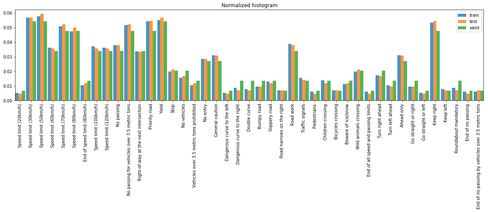

Here are example images from a few classes (a full survey is available in [Traffic_Sign_Classifier.ipynb](Traffic_Sign_Classifier.ipynb))
 
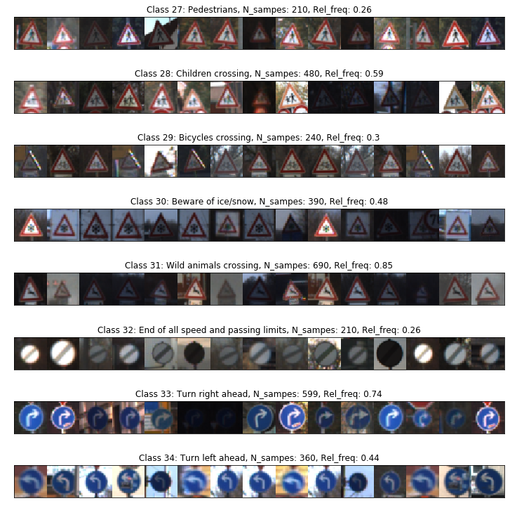


# Design and Test a Model Architecture


<!--
## Qualitative Findings

I started with a relatively well-known network (LeNet5) with settings to keep the network size small in order to iterate more quickly on a few topics and get some qualitative intuition. 
While none of these qualitative findings are conclusive, but they are useful initial guidelines

For example: 
* Are grayscale images better or should I use all color channels? What is the best way to "normalize" images regarding brightness, contrast and etc? 
    * See [Data Preprocessing](#data-preprocessing)
* How does the size of the data set compare the the size of the network? 
    * Should I use much much large networks or the starting point of LeNet5 is already work very well?
    * Is it better to "equalize" the sample count in each class or should I keep the relative occurrence as-is?
    * Does having much more augmented data help accuracy?
    * See [Data Autmentation](#data-augmentation)
-->

## Data Pre-processing and Augmentation

### Data Pre-processing
As shown in the previous section, the images within each class have very different brightness, sharpness and color saturation. 
In order to present data to the model in a consistent fashion, therefore to allow the model generalize better into test set.

Here are the steps in the preprocessing pipeline:

1. Covert color images to grayscale images
    * Through trial and error, I observed that using grayscale images seems to achieve better performance on test set. 
    This is might be slight counter-intuitive. It might be because although color images provide more information, the image quality vary greatly and might have offset the benefit.

2. Apply histogram equalization to get uniform contrast
    * Instead of a global histogram equalization (HE), which might have over exposure or under exposure on the region contains useful information, 
    I used a localized adaptive version - Contrast Limited Adaptive Histogram Equalization, with the setting ```cv2.createCLAHE(clipLimit=2.0, tileGridSize=(4, 4))```

3. Normalize to zero mean and unity variance
    * This is to normalize the numerical values globally.
    
To illustrate this process, let's take a look at the following example. The first row are the original images. Row 2, 3 and 4 corresponds to the output of
 step 1, 2 and 3 respectively. 
We can see that the preprocessing pipeline is indeed capable of normalizing out different brightness, recovering contrast from poor quality color images, and yielding a set
of more uniform quality images for use in the model.

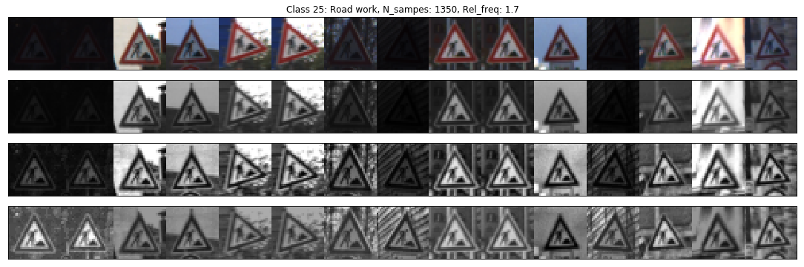


### Data set augmentation

A simple way to generate more data is to take advantage of the mirror symmetry in some of the signs. For example, in the sample images shown above,
if flipped horizontally, all class 33 images would become valid samples for class 34, all class 30 images would still be valid samples for class 30. 
This is implemented by ```flip_extend()``` in [tsc_utils.py](tsc_utils.py). (The credit of this flipping method goes to: https://github.com/navoshta)

In addition, a small change to the image should not affect the classification if the classfier is robust and well generalized. Based on this, I implemented
a set of functions to apply small changes to the sign images, these operations are:
* zoom in or out
* rotate left or right
* shift x and/or y
* sharpen or blur
* random distort (implemented with ```cv2.warpPerspective()``` and randomized corners)

Here is a example image with each of these operations applied 

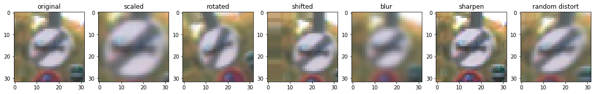

The overall function driving the augmentation is ```augment_data()``` in [tsc_utils.py](tsc_utils.py). 
It has a scaling parameter ```factor``` that controls the magnitude of all these operations.


I prepared 3 augmented data sets based on the flipping and augmentation methods discussed above. Only training and vaidation sets are augmented.
All the models listed in the next table are trained with all 3 data sets in sequence, with decreasing learning rates.

Here is a summary of the data sets:

| Data set | N_train | N_validation | Augmentation method |
| --- | ---: | ---: | ------------- |
| dataset0 | 34,799 | 4,410 | Original data set |
| dataset1 | 59,788 | 7,590  | Based on dataset0, applied ```flip_extend()``` |
| dataset2 | 1,016,396 | 129,030 | Based on dataset1, applied ```augment_data()``` with ```factor=1.0``` |
| dataset3 | 1,016,396 | 129,030 | Based on dataset1, applied ```augment_data()``` with ```factor=0.7``` |


## Model Architecture

### LeNet

I used LeNet5 as a starting point due to its good performance on other image classification tasks and relative small network size.

The LeNet model implemented here is slightly different than the classical implementation due to differences in padding and addition of dropout.

Two sets of parameters were used, one is dubbed "standard", the other is "big" which results in a much larger network. 

The model is described in the table below.

| Layer Type      		| Layer Name     |     Description ({standard, big})	| 
|:---:|:---:|:---| 
| Input         		|               | 32x32x1 grayscale image | 
| Convolution 5x5     	| conv1     	| 1x1 stride, same padding, outputs 32x32x **{6,24}**, ReLu |
| Max pooling 2x2      	| pool1      	| 2x2 stride, outputs 16x16x **{6,24}**, dropout 5% |
| Convolution 5x5	    | conv2         | 1x1 stride, same padding, outputs 16x16x **{16,64}**, ReLu |
| Max pooling 2x2      	| pool2         | 2x2 stride, outputs 8x8x **{16,64}**, dropout 5% |
| Flatten | | Flattens output of pool2 |
| Fully connected		| fc3           | Inputs 1x **{1024, 4096}**, outputs 1x **{120,480}**, ReLu, dropout 50% |
| Fully connected		| fc4           | Inputs 1x **{120,480}**, outputs 1x **{84,252}**, ReLu, dropout 50% |
| Fully connected		| out           | Inputs 1x **{84,252}**, outputs 1x43, Softmax |


### Sermanet

The "sermanet" network closely follows [Sermanet / LeCunn paper](http://yann.lecun.com/exdb/publis/pdf/sermanet-ijcnn-11.pdf).

While both lenet and sermanet are based on 2 layers of convolution, ReLu activation followed by max pooling, 
the biggest difference lies in the way convolution layers are connected to the fully connected layer. 
In sermanet, both the max pooling output of the first convolution layer (poo1) and the second layer (pool2) are connected to the fully connected layer, thus feeding it with so-called 
multi-scale features because the two convolution layers are extracting difference features with different levels of abstraction.

Similar to LeNet, two sets of parameters are used, and the model architecture is described below.

| Layer Type      		| Layer Name     |     Description ({standard, big})	| 
|:---:|:---:|:---| 
| Input         		|               | 32x32x1 grayscale image | 
| Convolution 5x5     	| conv1     	| 1x1 stride, same padding, outputs 32x32x **{108,100}**, ReLu |
| Max pooling 2x2      	| pool1      	| 2x2 stride, outputs 16x16x **{108,100}**, dropout 10% |
| Convolution 5x5	    | conv2         | 1x1 stride, same padding, outputs 16x16x **{108,200}**, ReLu |
| Max pooling 2x2      	| pool2         | 2x2 stride, outputs 8x8x **{108,200}**, dropout 20% |
| Flatten | | Flattens and concatenates the outputs of pool1 and pool2 |
| Fully connected		| fc3           | Inputs 1x **{13824, 19200}**, outputs 1x **{100,200}**, ReLu, dropout 50% |
| Fully connected		| out           | Inputs 1x **{100,200}**, outputs 1x43, Softmax |


## Model Training

To train the models, I used ```tf.AdamOptimizer()``` optimizing the cross-entropy of the models' Softmax output values. 
The function managing the training process is ```train_model()``` in [tsc_utils.py](tsc_utils.py), for each model and parameter set, it would first generate a unique name in order to save and 
restore model properly. 

The learning rate is selected to be 0.001 for training with dataset1 for initial training, 0.0001 with dataset2 for re-training with larger number of samples and 0.00003 with dataset3 for fine tuning.

The training batch is 256, max number of epochs is 1001 and early stopping patience of 10 epochs (i.e. if loss does not improve within 10 epochs the training would stop and best epoch will be saved). 
In the final training with dataset3, usually training stops at ~50 epochs.

My models were trained on an entry-level GPU - Nvidia GTX 960. It took ~2 hours for lenet and ~10 hours for sermanet, when training with dataset3.


## Results and Discussion

The final results suggest that with "big" network, lenet and sermanet performed similarly well and is slightly better 
than the performance (98.97%) reported in [Sermanet / LeCunn paper](http://yann.lecun.com/exdb/publis/pdf/sermanet-ijcnn-11.pdf) as well as human performance (98.81%).

| Model | Parameter set | No. of trainable parameters | Validation accuracy | Test accuracy | 
| :---: | ---: | ---: | ---: | ---: | 
| lenet | standard | 139,391  | 95.48% | 97.14% | 
| lenet | big | 2,137,739  | 98.36% | **99.02%** |
| sermanet | standard | 1,681,359| 98.27% | 98.82% |
| sermanet | big | 4,351,643  | 98.60% | **99.02%** |

The following plots show the mistake frequencies (blue bars) versus the class label occurrences (orange bars) for the validation set and test set. 
We can see that the mistake frequency does not correlate class label occurrence. 
If we did observe an anti-correlation, we could try systematically generating more augmented training examples for under represented classes.

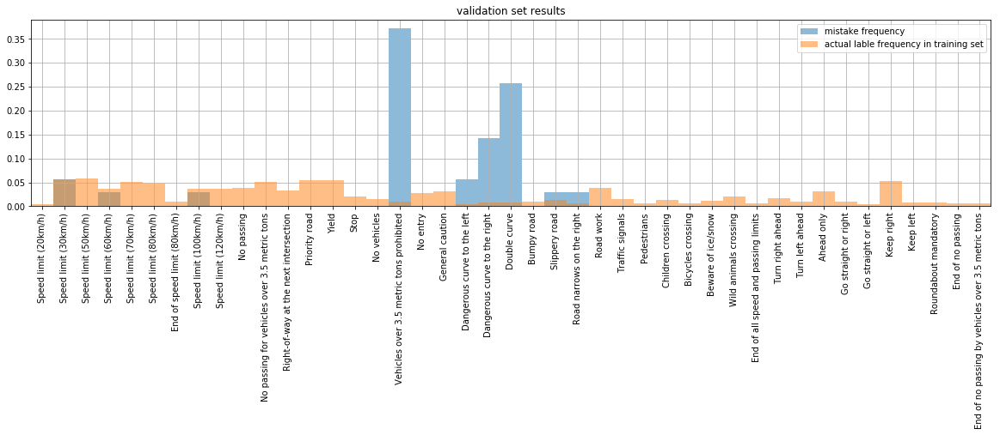
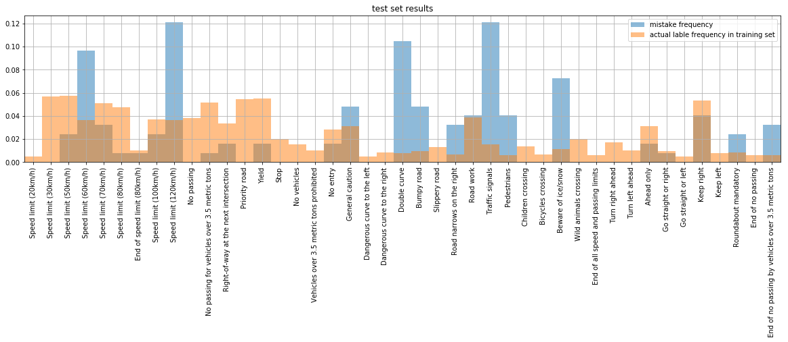


Looking at the mis-classified images from the test set, we can see the majority of them have very poor image quality or 
are distorted to a degree that is beyond what is covered in the augmented data set (scuh as the 120km/hr signs). 
There are however a few images in class 21 (Double Curves), that are clearly legible. 
This is a class that might benefit from more training samples, because we see a high error count in validation set as well.

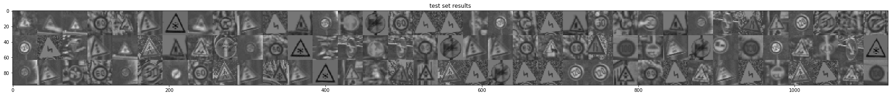

Among the mis-classified images, it might be useful to look at the confusion matrix. We can see the top confusions are:
* Traffic signs mis-classified as Speed limit(30km/h)
* Speed limit (60km/h) mis-classified as Speed limit(80km/h)
* Double curve mis-classified as General caution

To further improvement performance, in the future I could fine-tune the model with special data sets that contains these top confusions.

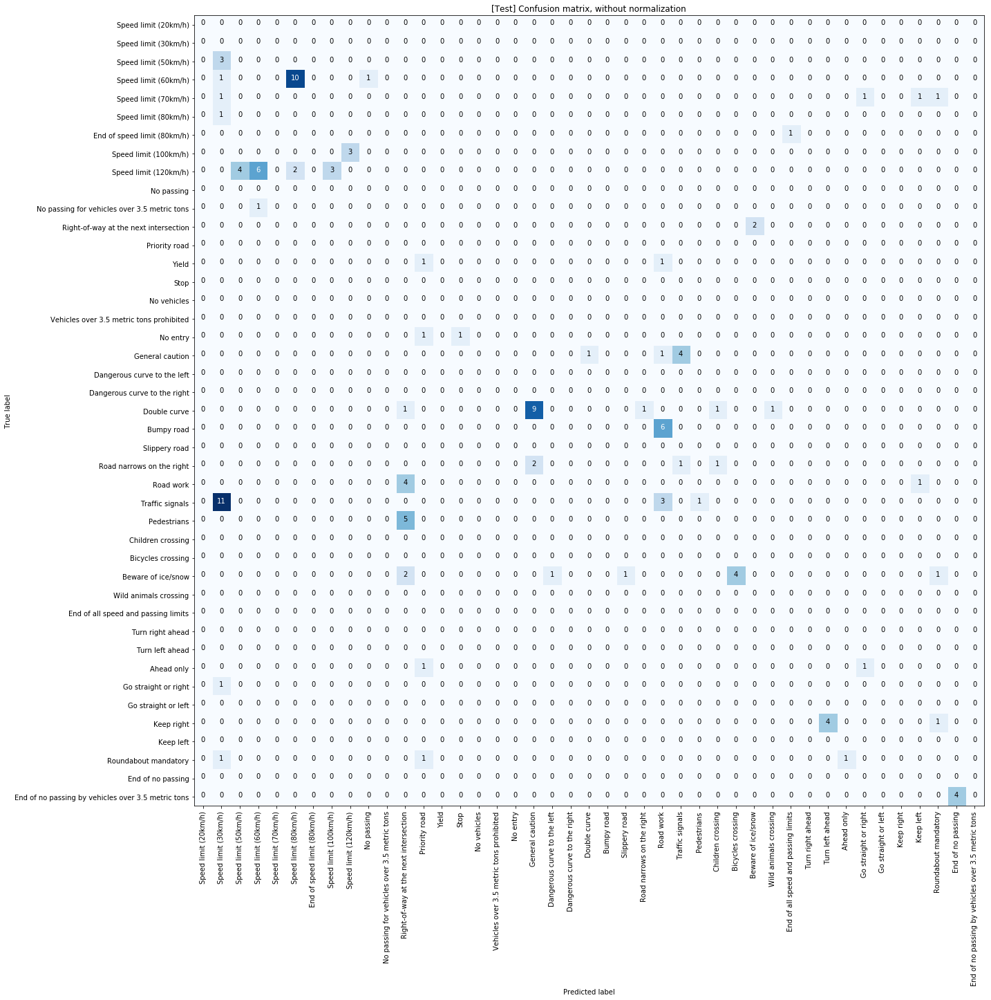

## Notes on Model Development

The image classification, a convolutional neural network is a natural choice because convolution operations extract features with efficient use of trainable parameters 
while being robust against features' position in the images.

The reason I picked LeNet as one of the models to use is mainly because LeNet is generally regarded as a good architecture for image classification tasks and is a good benchmark to have. 
I am very interested to see how it would performance against the more advanced networks.

Sermanet paper provides an interesting alternative approach that uses multi-scale features to feed forward into fully connected layers. 
Along the same idea, I attempted another network named sermanet_v2 with another convolution layer and flattened all three convolution layers to connect with fully connected layers. 
Sermanet_v2 has significantly more parameter and turned out to under perform both lenet and sermanet, so its performance is not reported here.

For both networks, I started with the smallest data set in order to iterate more quickly on hyper parameters in the model and in training and settled on learning rate, batch size, 
and pre-processing steps. To determine the network size, I start with a relative small network, and increase the network size until accuracy in validation diverge from training, 
which suggests over-fitting (and network being large enough). Then I added in dropout to bring them closer and achieve better accuracy.


# Test Models on New Images

## New Images

By walking through Google Street View, I collected 11 images from Munich, Germany, as shown below.

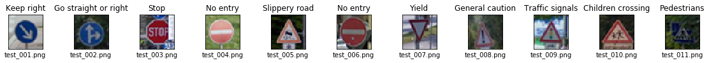

A few of these images might challenge the classifier:
* test_003: partially occluded
* test_009: significantly rotated
* test_010: intentionally scaled to have wrong aspect ratio
* test_011: compared to Pedestrians images (shown below), this image has the pedestrian symbol, but everything else is a bit different
    * rectangular shape instead of triangular
    * blue background with white boundary instead of white background with red boundary
    * additional drawing of crossing symbol
    * partially occluded

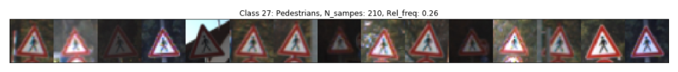

## Predictions

The model was able to correctly guess 11 of the 11 traffic signs, which gives an accuracy of 100%. It is particularly encouraging to see that test_011 was 
correctly classified despite of additional marking on the sign, occlusion of trees and a totally difference color scheme (thanks to the robustness of grayscale images and preprocessing)

The original images, images after pre-processing and the top-5 softmax output labels are plotted below.

(click to enlarge)
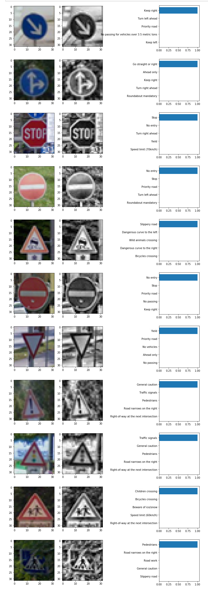


## Visualizing the Neural Network

A set of feature maps for each of images in the new test image set are included in the last cell in the HTML reports for lenet and sermanet. One example is shown below.

The 24 plots are the 24 output channels of the 1st convolution layer in model lenet with parameter set "big". We can see that some of the channels are particularly excited about 
the circular outline of the sign but not the inside of the sign, some of the channels emphasize on the top and bottom edge of the horizontal bar, these patterns give some indication 
about what kind of features might cause the units in the network to fire and eventually triggers a classification in the later stage of the network.
 
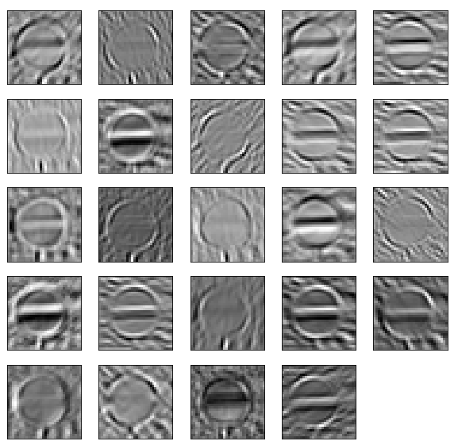


